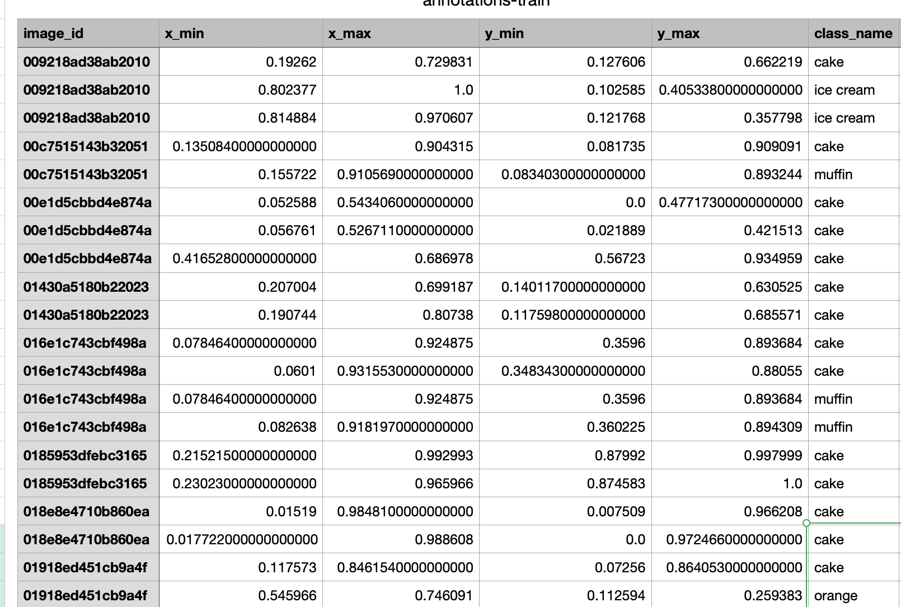
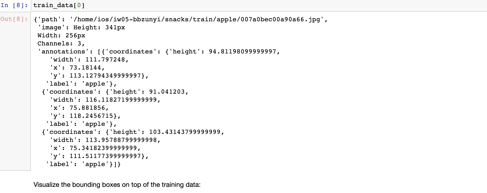
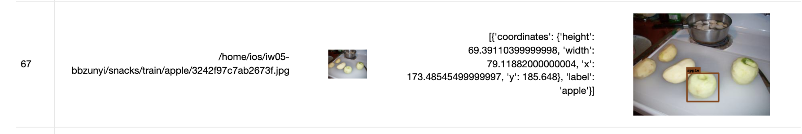
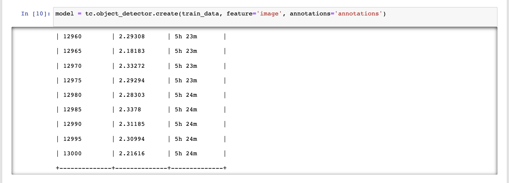
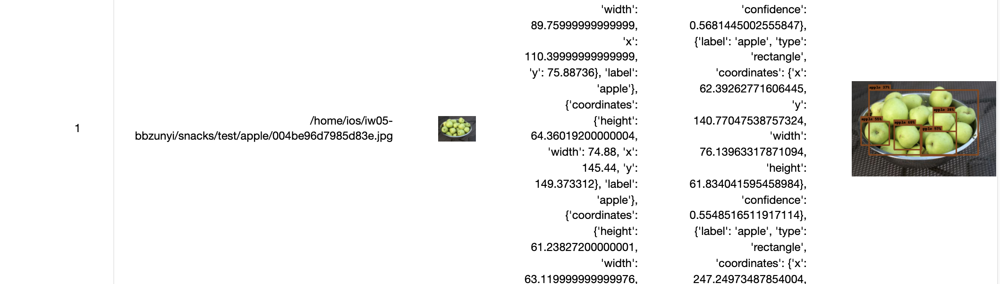

# Iw05

> @StuID:191220169
>
> @Name:张洋彬 

## iOS assignment 5: Object Detection App

### 1. 实验任务

#### 1.1 任务梗概

- 基于模板工程(ObjectDetection)，运用CoreML开发一个利用TinyYOLO进行目标检测的iOS App

#### 1.2 功能需求

- 通过TuriCreate，基于snacks数据集训练目标检测模型
- 运用摄像头功能，利用训练好的模型进行实时的目标检测，支持多目标检测
- 在屏幕上展示神经网络模型的分类结果和目标框(bounding box)


### 2. 实验过程

#### 2.1 通过TuriCreate，基于snacks数据集训练目标检测模型

​	首先通过ssh连接到曹老师提供的远程机器，使用`conda create -n env python=3.8`创建虚拟环境并在虚拟环境中安装好相应的库和依赖，在虚拟环境中使用`conda install nb-conda`，然后`jupyter notebook --port==20000`可以在指定的端口启动jupyter，转发到本地端口后，浏览器通过本地端口可以打开jupyter botebook，并且可以选择相应的虚拟环境。

​	snacks数据集里的csv数据如下，下标从1开始，将这些数据添加到img_annotations数组中。



​	在`load_images_with_annotations(images_dir, annotations_file)`函数中，将csv中的数据转化`pixel coordinates`,转换的代码如下：

```python
for i in rows.itertuples():
  img_annotations.append({"coordinates": {"height": (i[5] - i[4]) * img_height, 
                                          "width": (i[3] - i[2]) * img_width, 
                                          "x": (i[3] + i[2]) / 2 * img_width, 
                                          "y": (i[5] + i[4]) / 2 * img_height}, 
                          "label": i[6]})
```

​	然后开始运行模型，通过output判断，转化正确，output如下所示：



​	调用train_data.explore()，发现bounding box正常，如下图所示：


经过13000轮迭代后，导出模型：

	

模型训练完成后进行测试，通过test_data.explore()函数可以发现能够正常画出边框



#### 2.2 完成ObjectDetection项目

​	将模型导入`ObjectDetection`项目，完成项目中空缺的函数

​	在`processObservations`函数中，调用show函数，将结果作为参数传入，代码如下：

```swift
func processObservations(for request: VNRequest, error: Error?){
        DispatchQueue.main.async{
            if let results = request.results as? [VNRecognizedObjectObservation]{
                if results.isEmpty {
                    print("nothing found!")
                } else {
                    self.show(predictions: results)
                }
            }else if let error = error{
                print(error.localizedDescription)
            }else{
                print("???")
            }
        }
    }
```

​	在`show`函数中，实现边框的显示，bounding box的最大数量为10，如果大于10只显示前10个，如果小于10，多余的隐藏，代码如下图所示：

```swift
func show(predictions: [VNRecognizedObjectObservation]) {
     //process the results, call show function in BoundingBoxView
        for boxID in 0..<boundingBoxViews.count{
            if boxID >= predictions.count{
                boundingBoxViews[boxID].hide()
                continue
            }
            let prediction = predictions[boxID]
            let width = view.bounds.width
            let height = width * 1280 / 720
            let offsetY = (view.bounds.height - height) / 2
            let scale = CGAffineTransform.identity.scaledBy(x: width, y: height)
            let transform = CGAffineTransform(scaleX: 1, y: -1).translatedBy(x: 0, y: -height - offsetY)
            let rect = prediction.boundingBox.applying(scale).applying(transform)
            
            let label: String = prediction.labels[0].identifier + "\(prediction.labels[0].confidence * 100)%"
            let color = colors[prediction.labels[0].identifier]!
            boundingBoxViews[boxID].show(frame: rect, label: label, color: color)
        }
    }
```

​	不需要手动将bounding box加入视图中，setupCamera中实现了VideoCapture的委托和setup函数,将bounding box view添加到了videoPreview.layer中。

```swift
videoCapture = VideoCapture()
    videoCapture.delegate = self

    // Change this line to limit how often the video capture delegate gets
    // called. 1 means it is called 30 times per second, which gives realtime
    // results but also uses more battery power.
    videoCapture.frameInterval = 1

    videoCapture.setUp(sessionPreset: .hd1280x720) { success in
      if success {
        // Add the video preview into the UI.
        if let previewLayer = self.videoCapture.previewLayer {
          self.videoPreview.layer.addSublayer(previewLayer)
          self.resizePreviewLayer()
        }

        // Add the bounding box layers to the UI, on top of the video preview.
        for box in self.boundingBoxViews {
          box.addToLayer(self.videoPreview.layer)
        }

        // Once everything is set up, we can start capturing live video.
        self.videoCapture.start()
      }
    }
```

​	最后运行app，进行真机调试，可以较准确显示出边框。

### 3. 实验心得

​		这次实验更重要的应该是体会过程，在使用turicreate训练模型时，主要遇到的是ssh连接到远程服务器、转发到本地端口并配置环境的问题，在此特别鸣谢蒙一涵同学和徐老师，能够成功训练出模型并导入到Xcode的时候觉得挺有成就感的。在xcode里的实现倒没什么好说的，就是一点基础的实现，主要是对整个过程的理解。做完了之后收获蛮多的，对turicreate、协议的理解都加深了。
